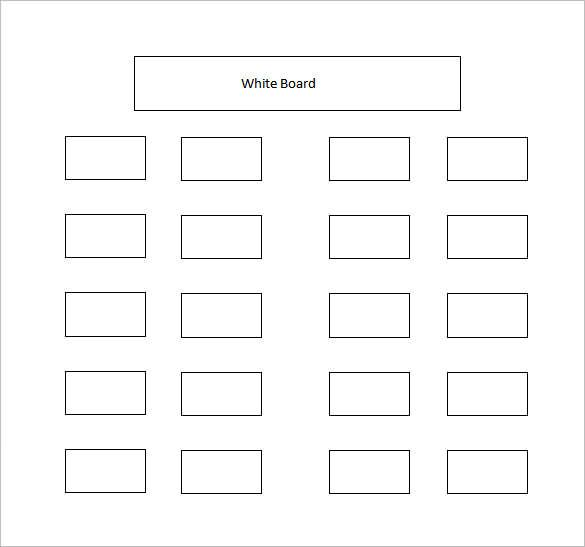
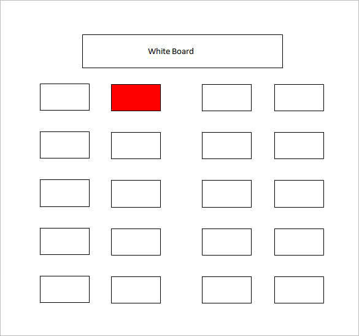
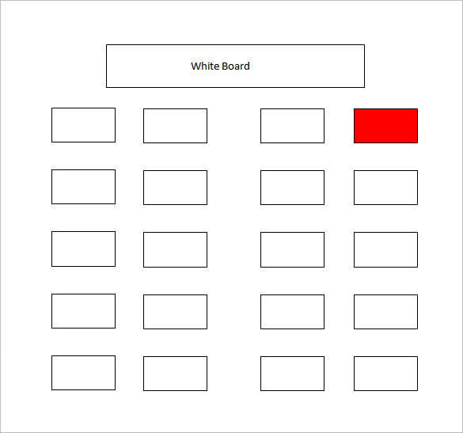
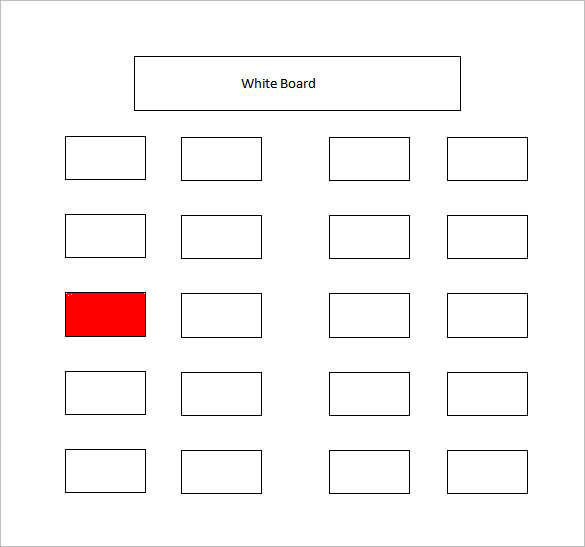
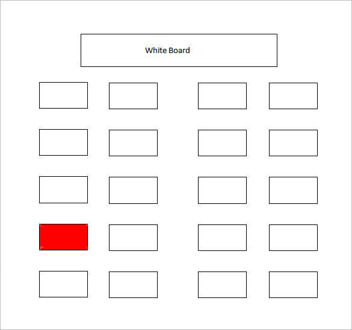
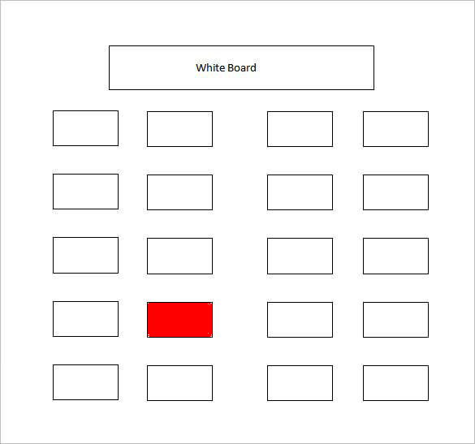
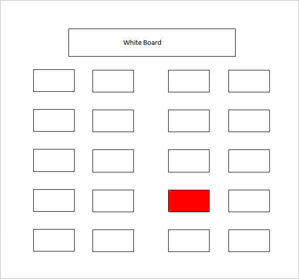
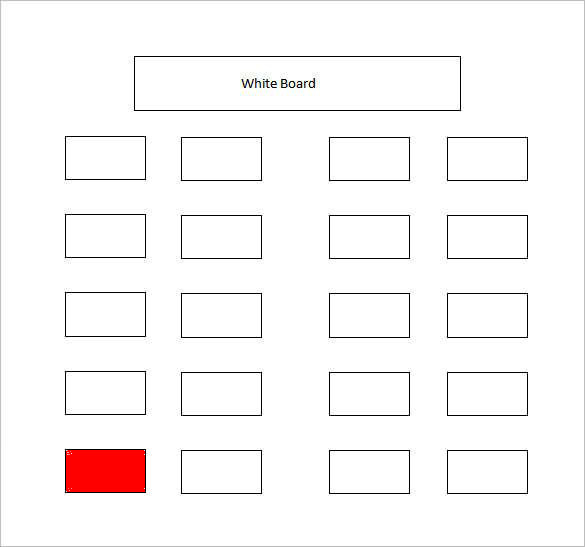
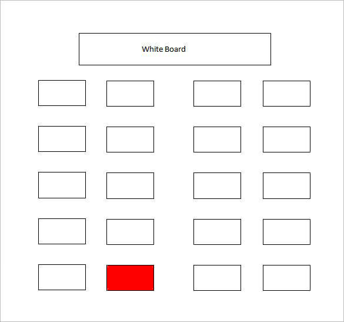
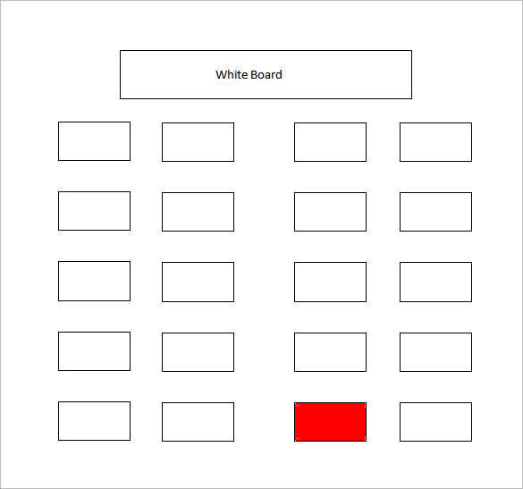

##

<table>
  <tr>
    <td style="border-bottom: none; font-weight: bold;">Name:</td>
    <td style="border-bottom: none;">____________________________</td>
  </tr>

  <tr>
    <td style="border-bottom: none; font-weight: bold;">Place of Birth:</td>
    <td style="border-bottom: none;">____________________________</td>
  </tr>

  <tr>
    <td style="border-bottom: none; font-weight: bold;">Pronouns:</td>
    <td style="border-bottom: none;"><u>e.g. He/Him ; She/Her ; They/Them</u></td>
  </tr>
</table>

##

<h2>Code & Data</h2>

##

##

##

##

##

##

##

##

##

##

##

##

##

##

##

##

##

##

##

##

##

## Data

::: incremental

* Nickname
* Given Name, Family Name
* Family Name, Given Name
* Names change
* Place names change
* Pronouns changes

:::

## 

<h1><a href="https://docs.google.com/forms/d/e/1FAIpQLSdN26_q4u-gbWlIfCmN0pnQOldRJAe5fIjLbUvcwSZlJ0kdWw/viewform">Survey</a></h1>

## Reading

* Severance, Chapter 1: Why should you learn to write programs?
* Peters, T. (2004). [The Zen of Python](https://www.python.org/dev/peps/pep-0020/).

