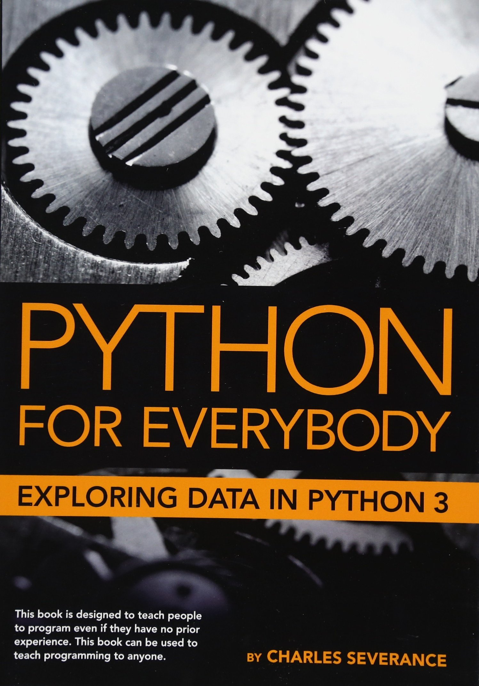
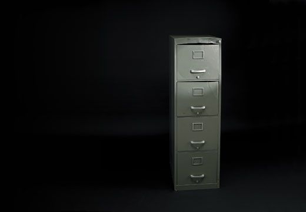
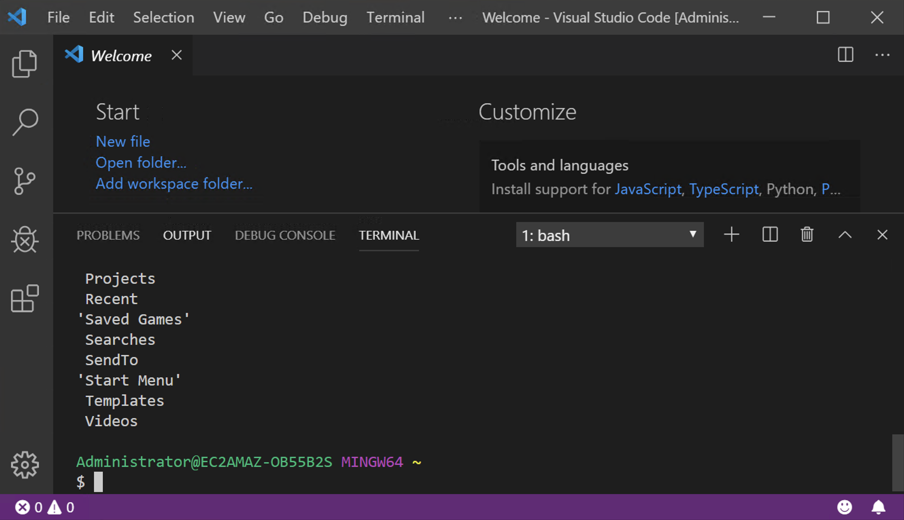
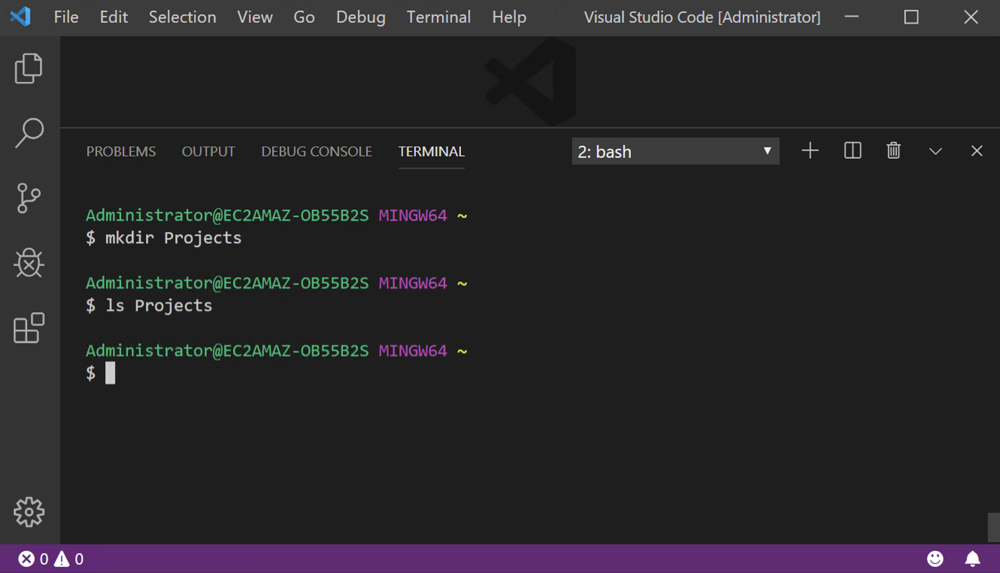
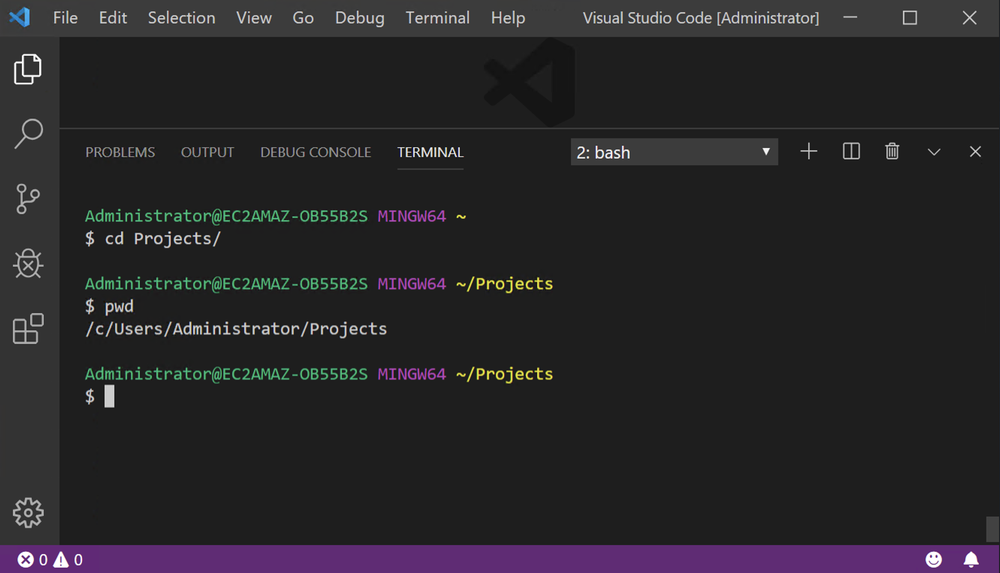

##

<figure style="border: none;">
  
  <figcaption>Chapter 1: Why should you learn to write computer programs?</figcaption>
</figure>

## 

<h3>What is *information*?</h3>

## 

 
 
 

1. Information as ***process***.
2. Information as ***knowledge***.
3. Information as ***thing***.

 
 
 

<cite>Buckland, M. K. (1991). Information as thing. *JASIS*, 42(5):351–360.</cite>

##

Information is a **pattern** of organization  
of matter and energy.

::: fragment

:::

<cite>Bates, M. (2005). Information and knowledge: an evolutionary framework for information science. *Information Research*, 10(4).</cite>

## 

<h3>Information have *politics*.</h3>

::: incremental

* Who can access to the information.
* Who can't access information.
* What information allows you to do.
* What information prevents you from doing.

:::

##

Why is understanding ***programming*** important  
for the study of ***information***?

## 

::: incremental

* Programs ***create*** information.
* Programs ***manipulate*** information.
* Programs ***analyze*** information.
* Programs ***visualize*** information.
* Programs ***share*** information.
* Programs ***are*** information.
* Programs are created by ***people***.
* Programs are created by ***other programs***.

:::

##

## 

## 

##

## 

## The File System

## 

##

## File System Commands

* **ls** - list directory contents
* **mkdir** - make directory
* **cd** - change directory
* **pwd** - present working directory
* **rm** - remove a file
* **cat** - concatenate and print files
* **tar** - manipulate tape archivesa

## pwd

## ls

## ls -al

## mkdir

## cd

## mkdir

## open

##

<h1>Homework #1</h1>
