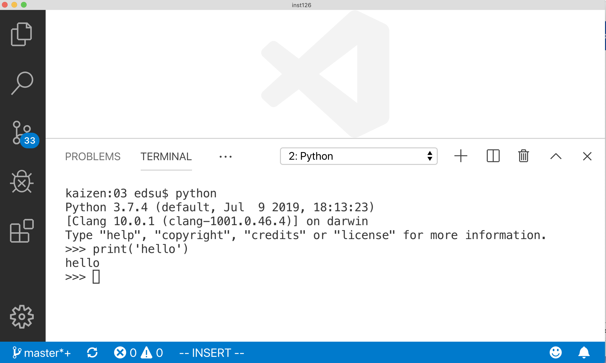
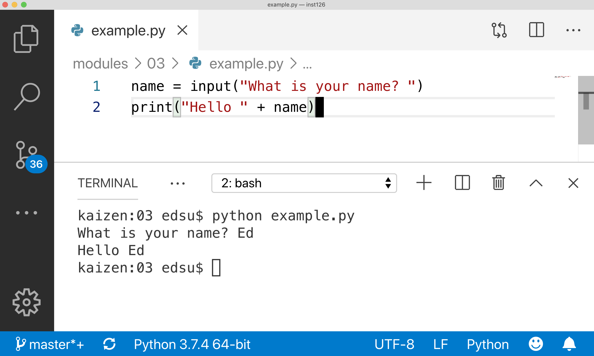

# 

::: {.left}

Python is an [imperative] programming language. Your programs are a series
of **Statements** that are executed in order.

Each **Statement** can be made up of
**Variables** and **Expressions**.

:::

#

<style>
.statement {
  font-size: larger;
  font-weight: bold;
  border: thin solid black;
  padding: 5px 20px 5px 20px;
  border-radius: 40px;
  background-color: lightgreen;
}
</style>

<span class="statement">1</span>

↓

<span class="statement">2</span>

↓

<span class="statement">3</span>

↓

<span class="statement">4</span>

#



# What are Variables?

<p class="left">
Variables are **names** that can be attached to **values**. Each variable has a **type**:
</p>

::: incremental

* integer:<br>
  `x = 1`
* string:<br>
  `x = "umd"`
* float:<br>
  `x = 1.5`
* boolean:<br>
  `x = True`

:::

#

<h1>a² = b² + c²</h1>


# Working with Variables

There are two main actions we take with variables:

* **assignment**: attach a name to some value
* **evaluation**: lookup the value by its name

# Practice with Variables

~~~ {.python}
>>> x = "Hello World"
>>> print(x)
hello world
~~~

# Errors

~~~ {.python}
>>> print(y)
Traceback (most recent call last):
  File "<stdin>", line 1, in <module>
NameError: name 'y' is not defined
~~~

# What are Expressions?

::: left

Expressions are Python that get **evaluated**, and are often 
created using **variables** and **operators**: 

:::

::: columns

:::: column

- equals: ***=***
- addition: **+**
- subtraction: ***-***
- multiplication: ***\****
- division: ***/***

::::

- parentheses: **()**
- exponent: **\*\***
- modulo: **%**
- equality: **==**
- comparison: **> <**

:::

# Practice with Expressions

# 

~~~ {.python .numberLines}
>>> x = 2 
>>> x * x
~~~

::: fragment
**4**
:::

#

~~~ {.python}
>>> x = 2
>>> x ** 3
~~~

::: fragment
**8**
:::

#

~~~ {.python}
>>> x = 2 
>>> y = 3
>>> x == y
~~~

::: fragment
**False**
:::

# 

~~~ {.python}
>>> x = 80
>>> y = 30
>>> x - y
~~~

::: fragment
**50**
:::

#

~~~ {.python}
>>> x = 2
>>> y = 3
>>> y - x + 4
~~~

::: fragment
**5**
:::

# 

~~~ {.python}
>>> x = 2
>>> 2 + x ** 3
~~~

::: fragment
**10**
:::

# Order of Operations

[PEMDAS](https://www.mathsisfun.com/operation-order-pemdas.html)

1. **P**arentheses
2. **E**xponents
3. **M**ultiplication & **D**ivision
4. **A**ddition & **S**ubtraction

#

~~~ {.python}
>>> 1 + 2 * 3
~~~

::: fragment
**7**
:::

#

~~~ {.python}
>>> (1 + 2) * 3
~~~

::: fragment
**9**
:::

#

~~~ {.python}
>>> 1 + 2 * (3 + 1) ** 2
~~~

::: fragment
**33**
:::

#

~~~ {.python}
>>> (1 + 2 * 3)
~~~

::: fragment
**7**
:::

#

Some operators behave differently depending on the *type*:

``` python
>>> "u" + "m" + "d"
```

::: {.fragment}
**umd**
:::

#

```python
>>> x = "umd"
>>> y = x * 5
>>> print(y)
```

::: fragment
**umd umd umd umd umd**
:::

#

::: left
But some operators don't work on when combined with different types 
of variables:
:::

~~~ {.python}
>>> x = "123"
>>> print(x + 5)
~~~

::: fragment
~~~ {.python}
Traceback (most recent call last):
  File "<stdin>", line 1, in <module>
TypeError: can only concatenate str (not "int") to str
~~~
:::

# 

You can convert types using the **int()**, **float()**, **str()** functions:

~~~ {.python}
>>> x = "123"
>>> y = int(x)
>>> print(y + 5)
~~~

::: fragment
**128**
:::

# What are Statements?

* Statements are the most basic units of executable Python code.
* A Python program is a series of statements executed in order.
* We've already been running them in the interpreter but now let's create our first program.

#

::: left
Let's put these statements in our first Python program and run it in VSCode.

We are using the **input** function (more about functions later) to read in input from the keyboard, and storing it in the variable **username**.
:::

~~~~ {.python}
username = input("Enter your name: ")
print("Hello " + username)
~~~~

#



# So ...

<p class="left">
We've covered a lot but now you know the basic buiding blocks of all Python
programs, and [imperative] programming languages in general:
</p>

::: incremental

* Variables
* Types
* Operators
* Expressions
* Statements

:::

[imperative]: https://en.wikipedia.org/wiki/Imperative_programming
