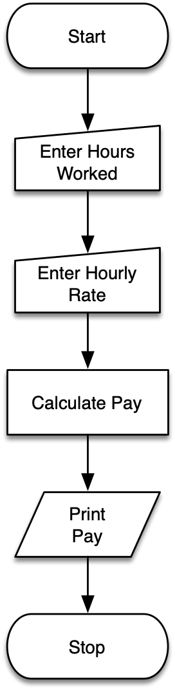
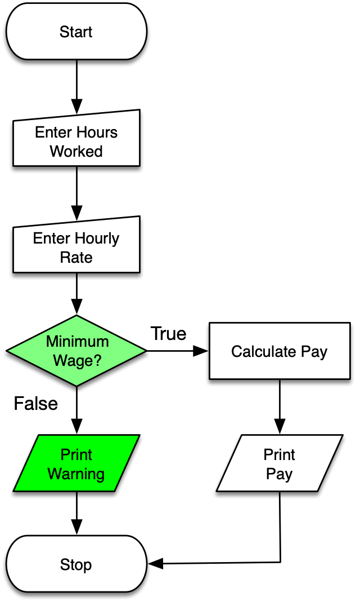

# Remember Statements?

~~~ {.python .numberLines}
hours = input("Hours worked: ")
hours = float(hours)

rate = input("Hourly rate: ")
rate = float(rate)

pay = hours * rate
print("Pay:", pay)
~~~

#

# 

#

True

 
 
 

False

# What are Conditionals?

::: {.incremental}

* In practice, you often do not want every *statement* in a program to be
  executed every time.
* Instead, you want your program to run differently depending on input data and other factors.
* *Conditionals* are created using *if/then* statements using *conditional* and *logical* operators.

:::

# Comparison Operators

<table>
<tr><td><b>==</b></td><td>equals</td></tr>
<tr><td><b>!=</b></td><td>not equals</td></tr>
<tr><td><b>&lt;</b></td><td>less than</td></tr>
<tr><td><b>&gt;</b></td><td>greater than</td></tr>
<tr><td><b>&gt;=</b></td><td>greater than or equal</td></tr>
<tr><td><b>&lt;=</b></td><td>less than or equal</td></tr>
</table>

#

  ~~~~ {.python}
  >>> x = 1
>>> x == 1
~~~~

::: {.fragment}
True
:::

#

~~~ {.python}
>>> x = 1
>>> x != 1
~~~

::: {.fragment}
False
:::

#

~~~ {.python}
>>> x = 1
>>> x > 1
~~~

::: {.fragment}
False
:::

#

~~~ {.python}
>>> x = 1
>>> x >= 1
~~~

::: {.fragment}
True
:::

#

~~~ {.python}
>>> x = 1
>>> x < 0
~~~

::: {.fragment}
False
:::

# Logical Operators

 

<table>
<tr><td style="font-size: 40pt; text-align: center; font-weight: bold;">or</td></tr>
<tr><td style="font-size: 40pt; text-align: center; font-weight: bold;">and</td></tr>
</table>

 
 
 

# 

~~~ {.python}
>>> True and False
~~~

::: fragment 
False
:::

#

~~~ {.python}
>>> True and True
~~~

::: fragment 
True
:::

#

~~~ {.python}
>>> True or False
~~~

::: fragment 
True
:::

#

~~~ {.python}
>>> False or False
~~~

::: fragment
False
:::

#

~~~ {.python}
>>> True and (False or True)
~~~

::: fragment
True
:::

#

~~~ {.python}
>>> x = 1
>>> y = 2
>>> (x != 1) or (y == 2)
~~~

::: fragment
True
:::

#

~~~ {.python}
>>> x = 1
>>> y = 2
>>> (x + y) <= 2.9
~~~

::: fragment
False
:::

# Conditional Statements

::: left
Conditional statements use the following keywords and conventions:
:::

* if
* else
* elif
* colon (:) to end the conditional clause
* indent conditional code

#

~~~ {.python .numberLines}
if 1 > 0:
    print("yes")
~~~

::: fragment
yes
:::

#

~~~ {.python .numberLines}
if 1 > 2:
    print("yes")
~~~

#

~~~ {.python .numberLines}
x = 1
if x > 2:
    print("yes")
else:
    print("no")
~~~

::: fragment
no
:::

#

~~~ {.python .numberLines}
x = int(input("Enter a number: "))

if x > 2:
    print("x is greater than 2")
elif x == 2:
    print("x equals 2")
else:
    print("x is less than 2")
~~~

::: fragment
no
:::

#

~~~ {.python .numberLines}
x = int(input("Enter a number: "))

if x > 2:
    print("x is greater than 2")
    print("x squared is", x ** 2)
elif x == 2:
    print("x equals 2")
else:
    print("x is less than 2")
~~~

::: fragment
no
:::

# 

 
 

<u>Exercise</u>

::: left
Modify your program for calculating pay so that it prints an error if an hourly
rate is lower than the minimum wage, $15.00 / hour.
:::
