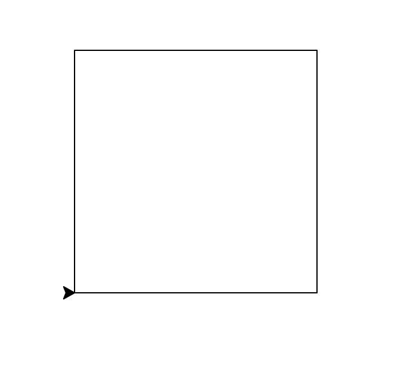
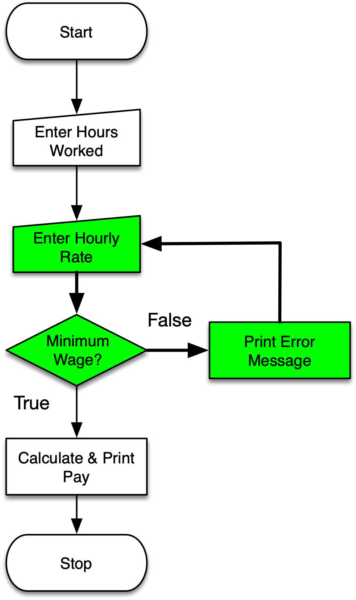

# Loops

::: columns 

:::: {.column .left}

Python programs are made up of a series of **statements** that execute in order.

**Loops** allow you to repeat a set of statements while a particular
**expression** evaluates to **True**.

::::

:::: column


::::

:::

# Why Loops? 

::: left

Imagine that you want to print all the positive integers less than 10. You
Would you want to do this for a million?

:::

``` {.python .numberLines}
print(1)
print(2)
print(3)
print(4)
print(5)
print(6)
print(7)
print(8)
print(9)
```

# While Loops

::: left

Instead you could use a **while loop** with a **variable** counter. This is very
useful if you want to print all the positive integers less than 1 million...

:::

``` {.python .numberLines}
i = 0
while i < 1000000:
    i = i + 1
    print(i)
```

#

``` {.python .numberLines}
i = 0
while True:
    i = i + 1
    print(i)
```

::: fragment
**Infinite Loop**
:::


# Break

::: left

The **break** keyword is used to break out of a loop. It can be useful in
situations where the work inside a loop can stop prematurely, or because the
loop is infinite.

:::

``` {.python .numberLines}
while True:
    line = input('> ')
    if line == 'done':
        break
    print(len(line))
print('Done!')
```

#

::: left

### iterate, v.

1. *transitive.* To do (something) over again; to perform (an action) a second
   time, or reproduce (an effect); to repeat; to renew. Now rare.
2. To say, mention, or assert again or repeatedly; to repeat.
3. To make double or twofold; to duplicate. Obsolete. rare.
4. *intransitive. Mathematics.* To employ iteration; to make repeated use of a
   formula by substituting in it each time the result of the previous
   application.

:::


# For Loops

::: left

The **for loop** lets you to **iterate** through a series of values. We'll be
learning more about **lists** in Module 8.

:::

``` {.python .lineNumbers}
days = ["Sun", "Mon", "Tue", "Wed", "Thu", "Fri", "Sat"]

for day in days:
    print(day)
```

# Loops In Loops

:::left

Imagine you want to print all possible consecutive rolls of a 6 sided dice:

:::

``` {.python .numberLines}
dice = [1, 2, 3, 4, 5, 6]

for i in dice:
    for j in dice:
        print(i, j)
```

# Iteration and Functions

::: left

It's often useful to combine **loops** with **functions**. For example: convert
a list of temperatures from Fahrenheit to Celsius:

:::

``` {.python .numberLines}
def celsius(f):
    return (f - 32) * (5 / 9)

temps_f = [32, 81, 95, 21]

for f in temps_f:
    print(f, celsius(f))
```

# 



# Review

::: incremental

* **while** can be used to construct a loop that will continue as long as a
  particular **condition** evaluates to **True**.
* **for** can be used to **iterate** through a set of values in a list. As will see it 
  can be used to iterate through other things like files and rows in a database.
* **loops/iterators** can contain **loops/iterators**.
* **functions** and **loops/iterators** are super useful together.

:::

#


#


