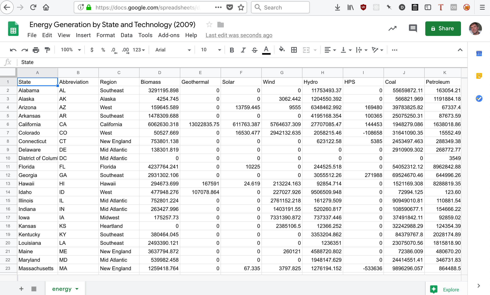

---
title: Reading & Writing Files
subtitle: Text, CSV and JSON
revealjs-url: ../../lib/reveal
theme: inst326
transition: slide
--- 

#

<a href="https://www.smithsonianmag.com/history/the-worlds-most-famous-filing-cabinet-36568830/">
  
</a>

::: notes

The filing cabinet that government agents broke into to steal the medical
records of Daniel Ellsberg, who was responsible for leaking the 
Pentagon Papers, which helped bring an end to the Vietnam War, and later
the Nixon Presidency. The filing cabinet is in the Smithsonian American History
Museum.

:::

#

<a href="https://www.acc.af.mil/News/Photos/igphoto/2001845476/">
  
</a>

::: notes

An example of a file.

:::

# 

<a href="https://patents.google.com/patent/US722709">
  
</a>

::: notes

Patent filed in 1902 for the Expansible filing system by The Library Bureau
that become Remington Rand (famous for its type writers) and later invented
one of the first computers the UNIVAC for the US Census.

:::

#


::: notes

The metaphor of the "file system" lives on in our computers.

:::

# File Path

<br>

**Absolute**

```
/Users/edsu/inst326/slides.pdf
```

<br>


**Relative**

```
inst326/slides.pdf
```


#


# Text, CSV and JSON

# Text Files

::: left

[speech.txt](speech.txt) is an example of a text file. Here are a few things to
notice about text files:

:::

* text files often have a **.txt** file extension
* text files have lines separated by **newline** characters
* text files have an **encoding**, usually [Unicode](https://en.wikipedia.org/wiki/Unicode)

# Read a Text File

::: left
Use the [open](https://docs.python.org/3.7/library/functions.html#open) function
to open a file using the file's **path** as a parameter. Use the file object's
**read** method to read the contents of the file into a variable.
:::

``` {.python .numberLines}
fh = open('speech.txt')
text = fh.read()
print(text)
```

# Writing a Text File

::: left
You can also use the **open** function to open a file for **writing** by passing
in **w** as a second argument to open. This then allows you to write data to a
file.
:::

``` {.python .numberLines .smaller}
fh = open('sonnet.txt', 'w')

fh.write('So long as men can breathe, or eyes can see,\n')
fh.write('So long lives this, and this gives life to thee.\n')

fh.close()
```

# Iterating

::: left
You can use a **for loop** to iterate through the lines in a file object.

Why might it be important to be able to read a file line by line instead of all at
once?
:::

``` {.python .numberLines}
for line in open('speech.txt'):
    print(line)
```

# Spreadsheets

<a href="https://docs.google.com/spreadsheets/d/1WtTBIS2KsJMpLOMAQKFPwLYJ8AwG2ug-W5XXFp5fUMk/edit?usp=sharing"></a>

::: notes
There are lots of different spreadsheet programs that have different file
formats. To make it easier to publish data so that it can be used in different
tools the CSV format was created.
:::

# CSV

<a href="energy.csv"></a>

::: fragment
**Comma Separated Values**
:::

# Read a CSV File

::: left
While it would be possible to read a CSV file as a text file Python's [csv
module](https://docs.python.org/3/library/csv.html) helps you do it.
:::

``` {.python .numberLines}
import csv

fh = open('energy.csv')
spreadsheet = csv.reader(fh)

for row in spreadsheet:
    print(row)
```

# Read a CSV File

::: left
The [csv.DictReader](https://docs.python.org/3/library/csv.html#csv.DictReader) class uses the column headers in your CSV file to create a dictionary for each
row.
:::

``` {.python .numberLines}
import csv

fh = open('energy.csv')
spreadsheet = csv.DictReader(fh)

for row in spreadsheet:
    print(row['State'], row['Solar'])
```

# Write a CSV File

::: left
You can also use the [csv.writer](https://docs.python.org/3/library/csv.html#csv.writer) class to write a CSV file row by row.
:::

``` {.python .numberLines .smaller}
import csv

fh = open('salaries.csv', 'w')
spreadsheet = csv.writer(fh)

spreadsheet.writerow(['Name', 'Age', 'Department'])
spreadsheet.writerow(['Val', 19, 'Physics'])
spreadsheet.writerow(['Rick', 22, 'English'])
spreadsheet.writerow(['Hope', 20, 'Information Studies'])

spreadsheet.close()
```

# 

::: left
Unfortunately, not all data fits neatly into tables. What makes this
example hard to represent as a table?
:::

``` {.python .numberLines .small}
people = [
  {
    "name": "Val",
    "interests": ["astronomy", "hocky"]
  }, 
  {
    "name": "Rick",
    "interests": ["karaoke"]
  }
]
```

::: fragment
The interests can have one to many values.
:::

# APIs


# 

## Reading a JSON File

::: left
Python comes with a [json module](https://docs.python.org/3.7/library/json.html)
which makes it easy to read JSON using the [json.load](https://docs.python.org/3.7/library/json.html#json.load) function. We'll use it to load this JSON file of tweet data: [aoc.json](aoc.json).
:::

``` {.python .numberLines}
import json

fh = open('aoc.json')
tweets = json.load(fh)

for tweet in tweets:
    print(tweet['hashtags'])
```

# Write a JSON File

::: left
You can also use the [json.dump](https://docs.python.org/3.7/library/json.html#json.dump) function to save a data structure to a file.
:::

``` {.python .numberLines .smaller}
import json

people = [
  {"name": "Val", "interests": ["astronomy", "hocky"]}, 
  {"name": "Rick", "interests": ["karaoke"]}
]

fh = open('data.json', 'w')
json.dump(people, fh)
```

# In Summary 

::: left
We covered a lot of territory learning about input and output operations:
:::

* **Files** and **Paths**
* read & write **Text** files
* read & write **CSV** files
* read & write **JSON** files

