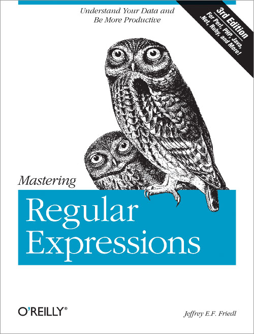
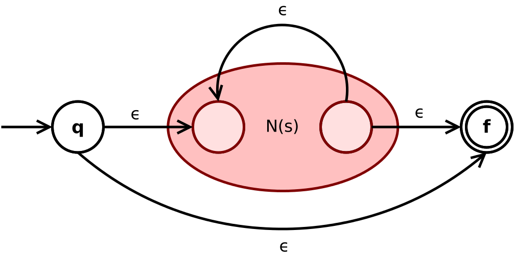
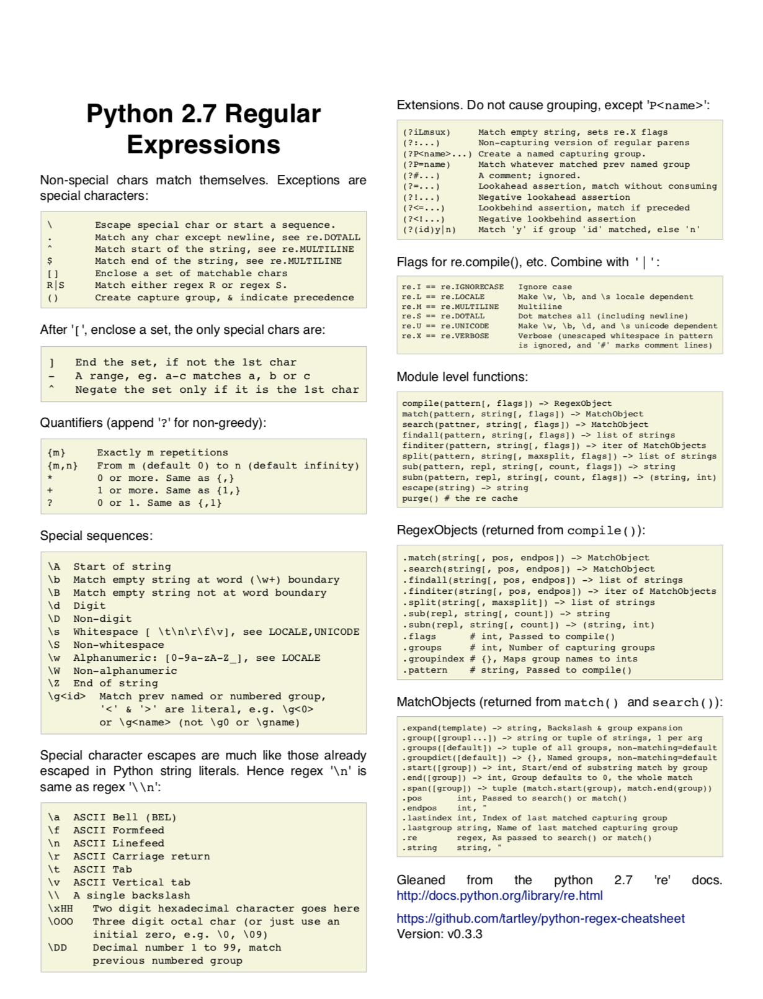

---
title: regex
subtitle: Regular Expressions
revealjs-url: ../../lib/reveal
theme: inst326
transition: slide
--- 

# 

::: {.left .smaller}
...early nightmares of climate crisis...<br>
...disagree on policy, but climate change is real...<br>
...our planet from climate change, and ice...<br>
...understand that climate change is an existential...<br>
...know it well-paid climate deniers are invited...<br>
...creeps in, allowing climate deniers to be...<br>
...goal is to treat Climate Change like the...<br>
...isn’t only about climate change - it’s...<br>
...housing, jobs, and climate all without...<br>
...delay real action on climate change, the more...<br>
...they helped create: climate change, housing...<br>
:::

::: notes

What patterns do you see in this text? These are snippets of AOC's tweets that
we looked at quickly last week.

:::

# 

::: {.left .smaller}
...early nightmares of ***climate crisis***...<br>
...disagree on policy, but ***climate change*** is real...<br>
...our planet from ***climate change***, and ice...<br>
...understand that ***climate change*** is an existential...<br>
...know it well-paid ***climate deniers*** are invited...<br>
...creeps in, allowing ***climate deniers*** to be...<br>
...goal is to treat ***Climate Change*** like the...<br>
...isn’t only about ***climate change*** - it’s...<br>
...housing, jobs, and ***climate all*** without...<br>
...delay real action on ***climate change***, the more...<br>
...they helped create: ***climate change***, housing...<br>
:::

::: notes

Yes, the word climate is in each snippet. Do you see any that are different?
We're going to look at how to extract these words near the end of class today.

:::

# 

<iframe width="80%" height="500" src="https://www.youtube.com/embed/kqUR3KtWbTk"
frameborder="0" allow="accelerometer; autoplay; encrypted-media; gyroscope;
picture-in-picture" allowfullscreen></iframe>

::: notes

Regular expressions are a tool that helps you find patterns in textual data.
Text can mean many things from working with genetics or financial data, to 
scraping information from the web (which we will be looking at after Spring
Break. 

:::

#

<a href="http://regex.info/book.html"></a>

::: notes

Regular Expressions operate much like their own computer language.
Implementations of regular expressions exist in all major programming languages. Here is a
popular book about them that is 544 pages long! We will obviously just be 
scratching the surface today.

:::

#

::: columns

:::: column

<a href="https://upload.wikimedia.org/wikipedia/commons/8/8e/Thompson-kleene-star.svg"></a>

::::

:::: column 

<a href="https://en.wikipedia.org/wiki/Stephen_Cole_Kleene"></a>

::::

:::

::: notes

The idea of regular expressions is almost as old as computing itself. They were
created by mathematician Stephen Cole Kleene in 1951 with his idea of 'regular
languages'. They started to get used heavily in the 1960s as part of early text
editors, as well as compilers for programming languages. You can still see them in
VSCode today.

:::

#

## wdloh@umd.edu

<br>
<br>

``` 
\A[a-z0-9!#$%&'*+/=?^_`{|}~-]+(?:\.[a-z0-9!#$%&'*+/=?^_`{|}~-]+)*@ (?:[a-z0-9](?:[a-z0-9-]*[a-z0-9])?\.)+[a-z0-9](?:[a-z0-9-]*[a-z0-9])?\z
```

::: notes

This is an example of a very complicated regular expression that matches (most) email addresses.It's hard to read right?

:::

# 

::: left

> Some people, when confronted with a problem, think 
> "I know, I'll use regular expressions." Now they have two problems.
>
> -- [Jamie Zawinski](http://regex.info/blog/2006-09-15/247)

:::

#

``` {.python .numberLines}
import re

s = "To be or not to be."

match = re.search("Be", s)

if match:
    print("match!")
else:
    print("no match :(")
```

::: fragment
**no match :(**
:::

#

``` {.python .numberLines}
import re

s = "To be or not to be."

match = re.search("Be", s, re.IGNORECASE)

if match:
    print("match!")
else:
    print("no match :(")
```

::: fragment
**match!**
:::

#

**\\w** word character

``` {.python .numberLines}
import re

s = "To be or not to be."

match = re.search("\w\w\w", s)

print(match.group())
```

::: fragment
**not**
:::

#

**\\d** digit/number

**+** one or more

``` {.python .numberLines}
import re

s = "32 Penn-Lyle Road, Princeton Jct, 08550"

match = re.search("\d+", s)

print(match.group())
```

::: fragment
**32**
:::

#

**$** end of string

``` {.python .numberLines}
import re

s = "32 Penn-Lyle Road, Princeton Jct, 08550"

match = re.search("\d+$", s)

print(match.group())
```

::: fragment
**08550**
:::

#

**findall()**

``` {.python .numberLines}
import re

s = "32 Penn-Lyle Road, Princeton Jct, 08550"

for s in re.findall("\d+", s):
    print(s)
```

::: fragment
**32**  
**08550**
:::

#

<a href="cheatsheet.pdf"></a>

#

::: left

Remember this [JSON dataset](aoc.json)? Let's imagine we wanted to find all the words that follow "climate" in AOC's tweets. How could we do that?

:::

#

## Grouping

``` {.python .numberLines}
import re
import json

fh = open('aoc.json')
tweets = json.load(fh)

for tweet in tweets:
    m = re.search('climate (\w+)', tweet['text'])
    if m:
        print(m.group(1))
```

#

::: left

For the next class take a look at the [exercise](exercise.html) that we'll be working on together.

<a href="https://www.nytimes.com/2019/02/22/business/enron-ceo-skilling-scandal.html"></a>

:::

