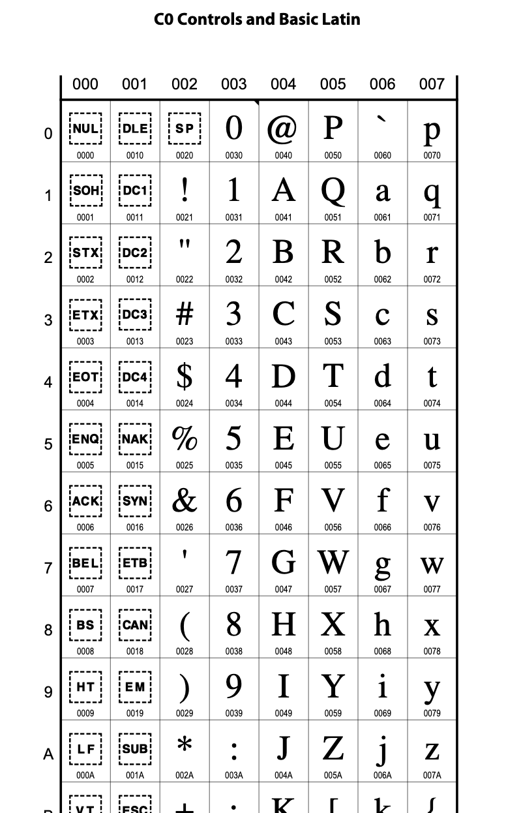
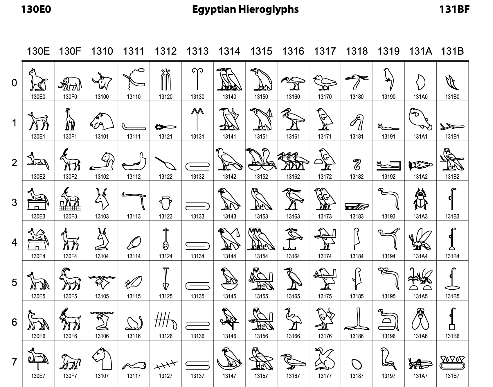
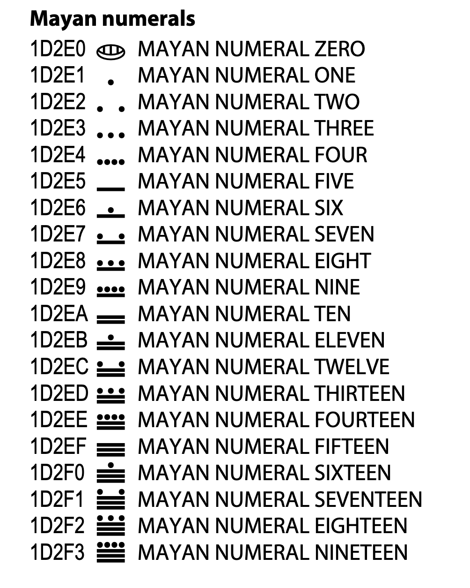
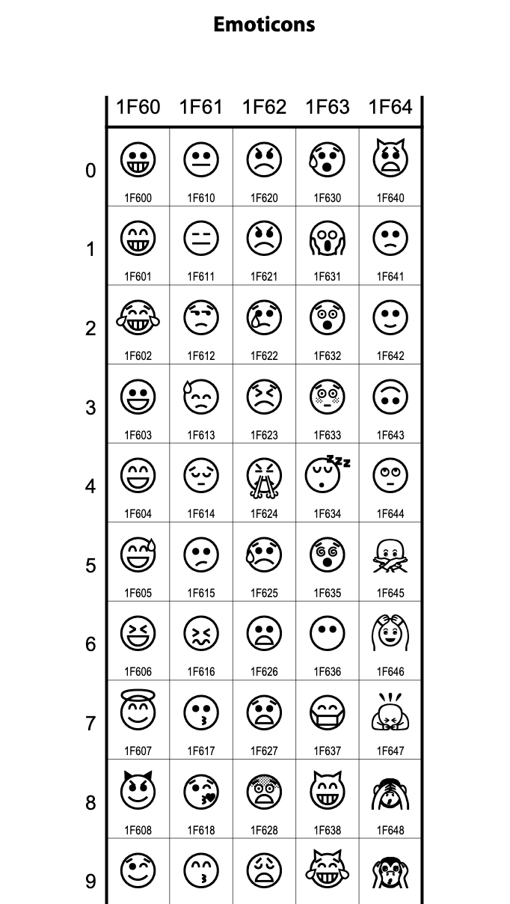
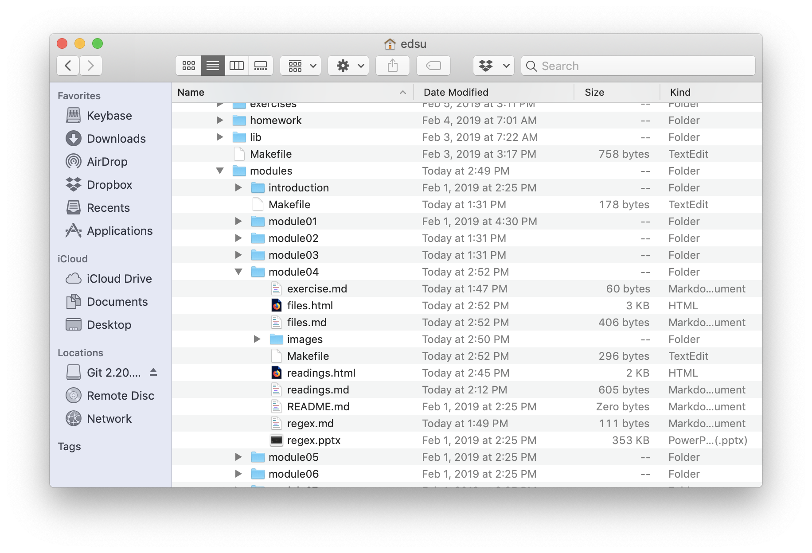
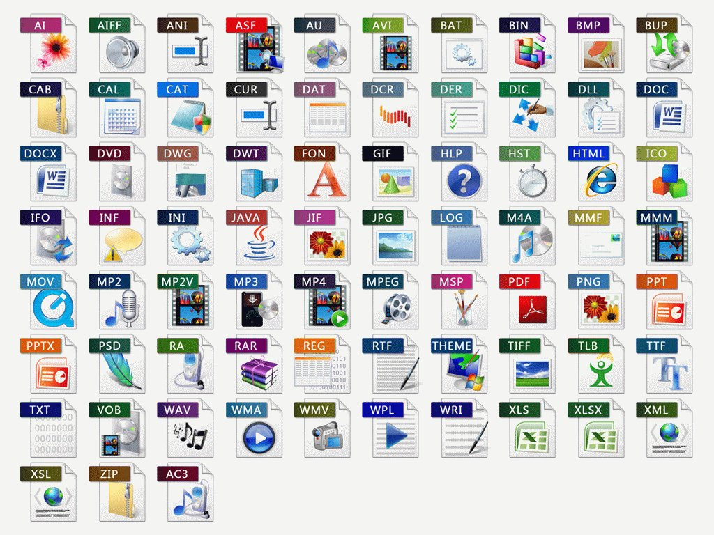

---
title: Data Structures 1
subtitle: Strings & Files
revealjs-url: ../../lib/reveal
theme: inst126
transition: slide
--- 

# From atoms to molecules

::: incremental

* We have already introduced some of the basic building blocks of data (integers, floats, booleans, strings)
* All programming languages, including Python, supports combining these basic types into larger _data structures_
* You can think of the building blocks as atoms and the structures as molecules.

:::

# Strings

::: fragment
(again)
:::

#


#


# Strings are Objects

::: incremental

* Strings have *properties* and *methods*. Properties provide access to the
  data, and methods are like functions that are attached to the data. You'll learn 
  more about objects and methods in INST326.
* In addition to the [documentation](https://docs.python.org/3/library/string.html) you can use some Python functions for exploring in the interpreter:
  * **type()** - returns an object's class
  * **dir()** - returns list of available methods
  * **help()** - opens built-in documentation pages

:::

# Try it out (Interpreter)

``` {.python}
>>> s = "To be or not to be."
>>> type(s)
<class 'str'>
>>> help(s)
...
>>> dir(s)
...
```

# What are strings?

::: incremental

* Strings are textual data
* Strings are ordered sequences of characters
* The characters that make up a string are ["encoded"](https://en.wikipedia.org/wiki/Character_encoding) using a character set
* In Python (starting with v3), strings are encoded by default in [unicode](https://unicode.org), which means there is automatic support for any writing system (well, _almost_ any...)

:::

#

<a href="https://www.unicode.org/charts/PDF/U0000.pdf">
  
</a>

#

<a href="https://www.unicode.org/charts/PDF/U4E00.pdf">
  
</a>

#

<a href="https://www.unicode.org/charts/PDF/U13000.pdf">
  
</a>

#

<a href="https://www.unicode.org/charts/PDF/U1D2E0.pdf">
  
</a>

#

<a href="https://www.unicode.org/charts/PDF/U1F600.pdf">
  
</a>

# Creating strings

``` {.python .numberLines}
s = "To be or not to be"
```

::: incremental

* We create strings using quotation marks
* You can use single (\') or double (") quotes
* You cannot _mix_ single/double quotes when creating a string, but you can _nest_ them (useful if you need to make quotation marks part of a string)

:::

#


# Accessing strings

::: incremental

* Strings are sequences of characters
* By default the variable returns the whole sequence
* Parts of strings (called substrings) are accessed by index
* The first position of a string has an offset of zero

:::

::: fragment

``` {.python}
>>> x = 'To be or not to be.'
>>> x[3]
```

:::

::: fragment
**b**
:::

# String indices and slices

* The index is an integer representing the distance (offset) from the beginning of the string
* Sequences can be accessed by slicing (beginning and end separated by colon)

```python
>>> lyric = "Another one bites the dust."
>>> lyric[12:17]
```

::: fragment
**bites**
:::

# Negative indices


```python
>>> lyric = "Another one bites the dust."
>>> lyric[-5]
```

::: fragment
**d**
:::

::: fragment
```python
>>> lyric = "Another one bites the dust."
>>> lyric[-5:-1]
```
:::

::: fragment
**dust**
:::

# "Modifying" strings

::: incremental

* Strings are _immutable_ which means they do not change.
* However it's common to reassign a string variable.

:::

::: fragment

``` {.python .numberLines}
>>> x = 'hello'
>>> x = x.upper()  # reassigns x 
>>> print(x)
```

:::

::: fragment
**HELLO**
:::

# Iteration

``` python
for l in 'To be or not to be.':
  print(l)
```

# in

You can use the **in** operator with strings:

```python
>>> s = "To be or not to be."
>>> "to" in s
```

::: fragment
**True**
:::

::: fragment
```python
>>> "Be" in s
```
:::

::: fragment
**False**
:::

# String Methods

::: left

[Strings](https://docs.python.org/3/library/string.html) have lots of useful
[methods](https://docs.python.org/3/library/stdtypes.html#string-methods) like *upper()* which you just saw.  Here are a few more, but try using
*dir* and *help* to learn about them.

:::

::: columns

:::: column 

* [lower()](https://docs.python.org/3/library/stdtypes.html#str.lower)
* [upper()](https://docs.python.org/3/library/stdtypes.html#str.upper)
* [split(s)](https://docs.python.org/3/library/stdtypes.html#str.split)
* [join(words)](https://docs.python.org/3/library/stdtypes.html#str.join)

::::

* [capitalize()](https://docs.python.org/3/library/stdtypes.html#str.capitalize)
* [replace(old, new)](https://docs.python.org/3/library/stdtypes.html#str.replace)
* [find(s)](https://docs.python.org/3/library/stdtypes.html#str.find)
* [format(args)](https://docs.python.org/3/library/stdtypes.html#str.format)

:::: column

::::

:::

#

Some examples of using [*format()*](https://docs.python.org/3/library/string.html#formatspec)

``` {.python}
>>> pi = 22/7
>>> print(pi)
3.142857142857143
>>> print('Pi is {:.2f}'.format(pi))
3.14
```

# Files

#

<a href="https://www.smithsonianmag.com/history/the-worlds-most-famous-filing-cabinet-36568830/">
  
</a>

::: notes

The filing cabinet that government agents broke into to steal the medical
records of Daniel Ellsberg, who was responsible for leaking the 
Pentagon Papers, which helped bring an end to the Vietnam War, and later
the Nixon Presidency. The filing cabinet is in the Smithsonian American History
Museum.

:::

#

<a href="https://www.acc.af.mil/News/Photos/igphoto/2001845476/">
  
</a>

::: notes

An example of a file.

:::

# 

<a href="https://patents.google.com/patent/US722709">
  
</a>

::: notes

Patent filed in 1902 for the Expansible filing system by The Library Bureau
that become Remington Rand (famous for its type writers) and later invented
one of the first computers the UNIVAC for the US Census.

:::

#



::: notes

The metaphor of the "file system" lives on in our computers.

:::

# File Path

<br>

**Absolute**

```
/Users/edsu/inst326/slides.pdf
```

<br>


**Relative**

```
inst326/slides.pdf
```


#



# Text, CSV and JSON

# Text Files

::: left

[speech.txt](speech.txt) is an example of a text file. Here are a few things to
notice about text files:

:::

* text files often have a **.txt** file extension
* text files have lines separated by **newline** characters
* text files have an **encoding**, usually [Unicode](https://en.wikipedia.org/wiki/Unicode)

# Read a Text File

::: left
Use the [open](https://docs.python.org/3.7/library/functions.html#open) function
to open a file using the file's **path** as a parameter. Use the file object's
**read** method to read the contents of the file into a variable.
:::

``` {.python .numberLines}
fh = open('speech.txt')
text = fh.read()
print(text)
```

# Writing a Text File

::: left
You can also use the **open** function to open a file for **writing** by passing
in **w** as a second argument to open. This then allows you to write data to a
file.
:::

``` {.python .numberLines .smaller}
fh = open('sonnet.txt', 'w')

fh.write('So long as men can breathe, or eyes can see,\n')
fh.write('So long lives this, and this gives life to thee.\n')

fh.close()
```

# Iterating

::: left
You can use a **for loop** to iterate through the lines in a file object.

Why might it be important to be able to read a file line by line instead of all at
once?
:::

``` {.python .numberLines}
for line in open('speech.txt'):
    print(line)
```

# That was a lot!

::: incremental

* strings
* characters
* encoding
* string slices
* string methods
* files
* reading files
* writing files

:::

