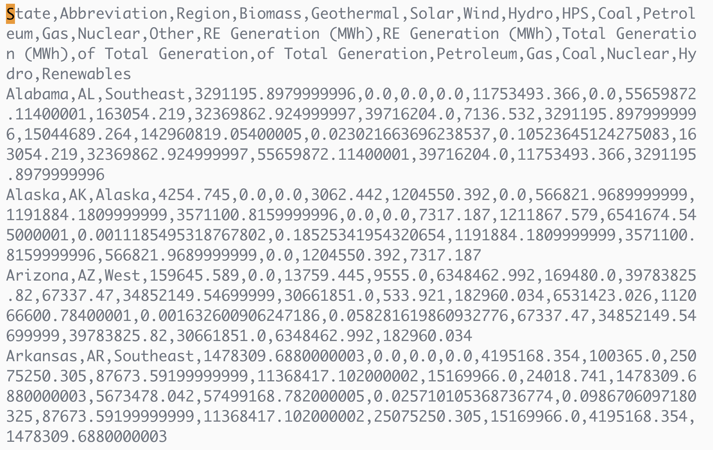

---
title: Data Structures 2
subtitle: Lists & CSV Files
revealjs-url: ../../lib/reveal
theme: inst126
transition: slide
---

#

<div style="font-size: 120pt;">Lists</div>

#

<a
href="https://en.wikipedia.org/wiki/Shopping_list#/media/File:Shopping_list_20170612.jpg"></a>

#

<a href="https://en.wikipedia.org/wiki/List_of_lists_of_lists"></a>

#

``` {.python .numberLines}
primes = [2, 3, 5, 7, 11, 13, 17, 19, 23, 29]
print(primes)
```

::: fragment
**[2, 3, 5, 7, 11, 13, 17, 19, 23, 29]**
:::

::: fragment
```{.python .numberLines}
print(primes[3])
```
:::

::: fragment
**7**
:::

# 

``` {.python .numberLines}
primes = [2, 3, 5, 7, 11, 13, 17, 19, 23, 29]
print(primes[3:7])
```

::: fragment
**[7, 11, 13, 17]**
:::

::: fragment
``` {.python .numberLines}
print(primes[7:])
```
:::

::: fragment
**[19, 23, 29]**
:::

#

``` {.python .numberLines}
shopping = ["milk", "beer", "bread", "onions", "salad"]
print(shopping)
```

::: fragment
**[\'milk\', \'beer\', \'bread\', \'onions\', \'salad\']**
:::

::: fragment
``` {.python .numberLines}
print(shopping[2])
```
:::

::: fragment
**bread**
:::

#

``` {.python .numberLines}
shopping = ["milk", "beer", "bread", "onions", "salad"]
print(shopping[2][3])
```

::: fragment
**a**
:::

# Mutate

``` {.python .numberLines}
shopping = ["milk", "beer", "bread", "onions", "salad"]
shopping[1] = "orange juice"
print(shopping)
```

::: fragment
**[\'milk\', \'orange juice\', \'bread\', \'onions\', \'salad\']**
:::

# append()

``` {.python .numberLines}
shopping = ["milk", "beer", "bread", "onions", "salad"]
shopping.append("tomatoes")
print(shopping)
```
::: fragment
**[\'milk\', \'beer\', \'bread\', \'onions\', \'salad\', \'tomatoes\']**
:::

# pop()

``` {.python .numberLines}
shopping = ["milk", "beer", "bread", "onions", "salad"]
item = shopping.pop()
print(item)
```
::: fragment
**salad**
:::

::: fragment
``` {.python .numberLines}
print(shopping)
```
:::

::: fragment
**[\'milk\', \'beer\', \'bread\', \'onions\']**
:::

# remove()

``` {.python .numberLines}
shopping = ["milk", "beer", "bread", "onions", "salad"]
shopping.remove("bread")
print(shopping)
```
::: fragment
**[\'milk\', \'beer\', \'onions\', \'salad\']**
:::

# Mixed Types

``` {.python .numberLines}
stuff = ["cat", 123, 45.3, True]
print(stuff)
```

::: fragment
**[\'cat\', 123, 45.3, True]**
:::


::: fragment
``` {.python .numberLines}
s = "dog"
stuff = ["cat", 123, s, 45.3, True]
print(stuff)
```
:::

::: fragment
**[\'cat\', 123, \'dog\', 45.3, True]**
:::

# Iteration

``` {.python .numberLines}
shopping = ["milk", "beer", "bread", "onions", "salad"]

for item in shopping:
    print("purchasing {}".format(item))
```

::: fragment
```
purchasing milk
purchasing beer
purchasing bread
purchasing onions
purchasing salad
```
:::

# len

``` {.python .numberLines}
shopping = ["milk", "beer", "bread", "onions", "salad"]
print(len(shopping))
```

::: fragment
**5**
:::


# min

``` {.python .numberLines}
numbers = [88, 22, 33, 18, 2]
print(min(numbers))
```

::: fragment
**2**
:::

# max

``` {.python .numberLines}
numbers = [88, 22, 33, 18, 2]
print(max(numbers))
```

::: fragment
**2**
:::

# sorted

``` {.python .numberLines}
numbers = [88, 22, 33, 18, 2]
numbers = sorted(numbers)
```

#

::: left
We could write a function to calculate the average of a list of numbers like
this:
:::

``` {.python .numberLines}
def average(l):
  count = 0
  total = 0
  for n in l:
      count += 1
      total += n
  return total / count

print(average([5, 4, 2, 22, 18, 12]))
```

::: fragment
**10**
:::

#

::: left
But isn't it much simpler to use the **sum()** and **len()** functions?
:::

``` {.python .numberLines}
def average(l):
  return sum(l) / len(l)

print(average([5, 4, 2, 22, 18, 12]))
```

::: fragment
**10**
:::

# Lists of Lists

``` {.python .numberLines}
my_list = [[1, 2, 3], [100, 200, 300], [50, 100, 150]]
print(my_list)
```

::: fragment
**[[1, 2, 3], [100, 200, 300], [50, 100, 150]]**
:::

::: fragment
``` {.python .numberLines}
print(my_list[1])
```
:::

::: fragment
**[100, 200, 300]**
:::

#

``` {.python .numberLines}
my_list = [[1, 2, 3], [100, 200, 300], [50, 100, 150]]
print(my_list[1][2])
```

::: fragment
300
:::

# 


# Spreadsheets

<a href="https://docs.google.com/spreadsheets/d/1WtTBIS2KsJMpLOMAQKFPwLYJ8AwG2ug-W5XXFp5fUMk/edit?usp=sharing"></a>

::: notes
There are lots of different spreadsheet programs that have different file
formats. To make it easier to publish data so that it can be used in different
tools the CSV format was created.
:::

# CSV

<a href="energy.csv"></a>

::: fragment
**Comma Separated Values**
:::

# Read a CSV File

::: left
While it would be possible to read a CSV file as a text file Python's [csv
module](https://docs.python.org/3/library/csv.html) helps you do it.
:::

``` {.python .numberLines}
import csv

fh = open('energy.csv')
spreadsheet = csv.reader(fh)

for row in spreadsheet:
    print(row)
```

# Read a CSV File

::: left
Since each row is an array you can interact with it like any other array.
:::

``` {.python .numberLines}
import csv

fh = open('energy.csv')
spreadsheet = csv.reader(fh)

for row in spreadsheet:
    state = row[0]
    solar = row[5]
    print(state, solar)
```

# Write a CSV File

::: left
You can also use the [csv.writer](https://docs.python.org/3/library/csv.html#csv.writer) class to write a CSV file row by row.
:::

``` {.python .numberLines .smaller}
import csv

fh = open('salaries.csv', 'w')
spreadsheet = csv.writer(fh)

spreadsheet.writerow(['Name', 'Age', 'Department'])
spreadsheet.writerow(['Val', 19, 'Physics'])
spreadsheet.writerow(['Rick', 22, 'English'])
spreadsheet.writerow(['Hope', 20, 'Information Studies'])

spreadsheet.close()
```
