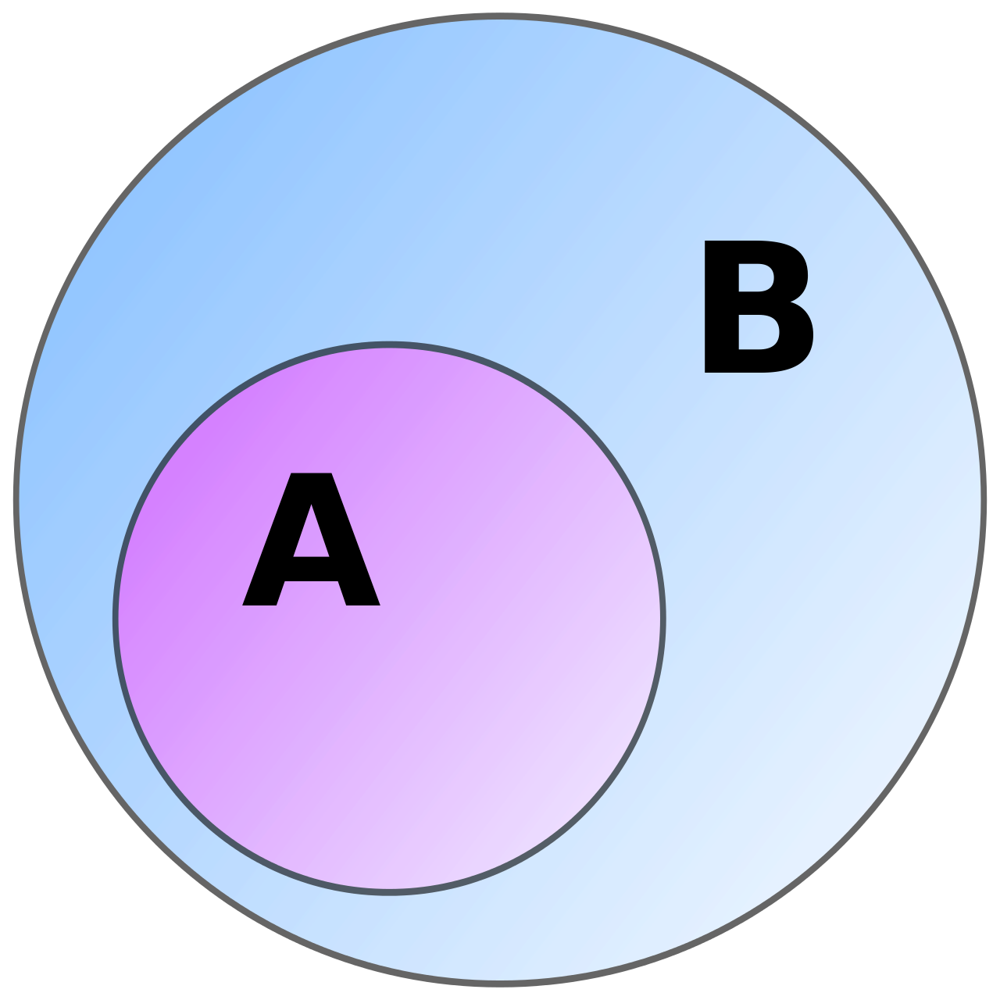

#

<div style="font-size: 120pt; font-weight: bold;">Sets</div>

#


# Create a Set

``` {.python .numberLines}
a = set([0, 1, 2, 3, 4, 5])

print(a)
```

::: fragment
```
set([0, 1, 2, 3, 4, 5])
```
:::

# Create a Set

``` {.python .numberLines}
a = {0, 1, 2, 3, 4, 5}

print(a)
```

::: fragment
```
set([0, 1, 2, 3, 4, 5])
```
:::

# Set Membership

``` {.python .numberLines}
a = set([0, 1, 2, 3, 4, 5])

print(2 in a)
```

::: fragmentA
```
True
```
:::

# Set Membership

``` {.python .numberLines}
a = set([0, 1, 2, 3, 4, 5])

print(9 in a)
```

::: fragment
```
False
```
:::

# Set Size

... or *cardinality*


``` {.python .numberLines}
a = set([0, 1, 2, 3, 4, 5])

print(len(a))
```

::: fragment
```
6
```
:::

# Iteration

``` {.python .numberLines}
a = set([0, 1, 2, 3, 4, 5])

for i in a:
    print(i * 2)

```

::: fragment
```
0
2
6
8
10
```
:::

# Not Just Numbers

``` {.python .numberLines}
nle = set([
    "Braves",
    "Marlins",
    "Mets",
    "Phillies"
])
```

# Add to a Set

``` {.python .numberLines}
nle = set([
    "Braves",
    "Marlins",
    "Mets",
    "Phillies"
])

nle.add("Nationals")
nle.add("Braves")
```

::: fragment
```
{"Braves", "Marlins", "Mets", Phillies", "Nationals"}
```
:::

# Remove from a Set

``` {.python .numberLines}
nle = set([
    "Braves",
    "Marlins",
    "Mets",
    "Yankees",
    "Phillies",
    "Nationals"
])

nle.remove("Yankees")
```

#


# Union

``` {.python .numberLines}
a = set([1, 2, 3])
b = set([4, 5, 6])

print(a.union(b))
```

::: fragment
```
{1, 2, 3, 4, 5, 6}
```
:::

#


# Intersection

``` {.python .numberLines}
a = set([1, 2, 3, 4])
b = set([3, 4, 5, 6])

print(a.intersection(b))
```

::: fragment
```
{3, 4}
```
:::

# 


# Difference

``` {.python .numberLines}
a = set([1, 2, 3, 4])
b = set([3, 4, 5, 6])

print(a.difference(b))
```

::: fragment
```
{1, 2}
```
:::

#



# Subset

``` {.python .numberLines}
a = set([1, 2, 3])
b = set([1, 2, 3, 4, 5, 6])

print(a.issubset(b))
```

::: fragment
```
True
```
:::

::: fragment
``` {.python .numberLines}
print(b.issubset(a))
```
:::

::: fragment
```
False
```
:::

#

<div style="font-size: 120pt; font-weight: bold;">Counters</div>

#

create a Counter

#

update a counter

#

print out a counter value

#

most common
