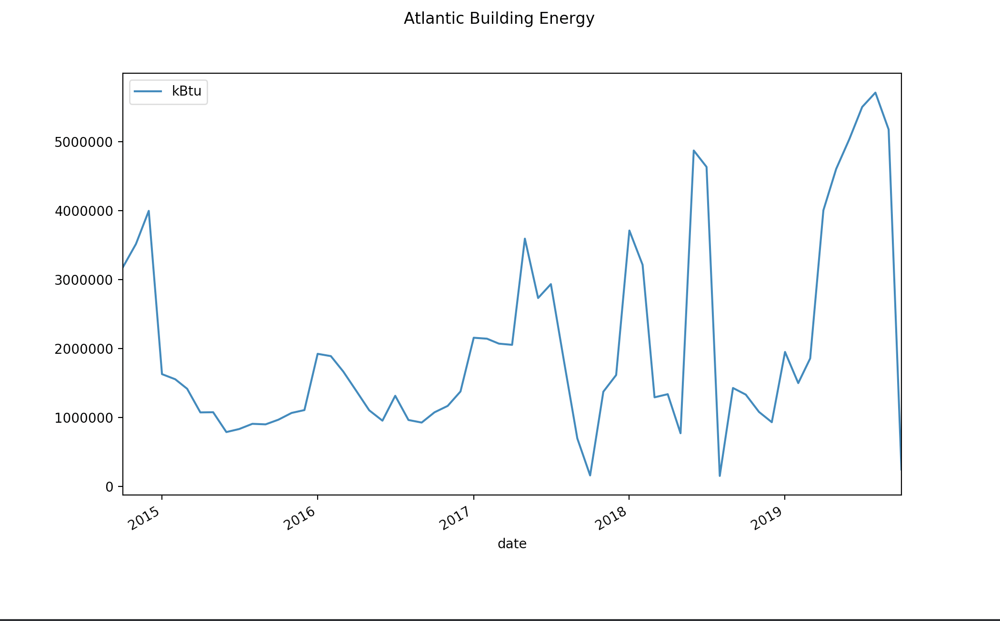

# 

<section data-background-image="images/map.png"></section>

# Buildings

``` python
>>> import pandas
>>>
>>> buildings = pandas.read_csv('buildings.csv')
>>> buildings.head()
```

::: fragment
``` smaller
                name      area  built  renovated  longitude   latitude
0       Energy Plant  39655.00   1931       2005 -76.935606  38.985843
1   Service Building  84030.42   1940       1970 -76.935830  38.986042
2   Ritchie Coliseum  59791.00   1932       1996 -76.936447  38.985035
3       Building 006  17716.77   1957       1970 -76.934517  38.985800
4  Pocomoke Building  30045.91   1946       2013 -76.937115  38.982956
```
:::

# 

<section data-background-image="images/download.png"></section>

# Energy

``` python
>>> energy = pandas.read_csv('energy.csv')
>>> energy.head()
```

::: fragment
``` smaller
       building                      date          kBtu
0  Energy Plant  2014-10-01T04:00:00.000Z  1.820209e+08
1  Energy Plant  2014-11-01T04:00:00.000Z  2.117367e+08
2  Energy Plant  2014-12-01T05:00:00.000Z  2.434488e+08
3  Energy Plant  2015-01-01T05:00:00.000Z  2.626871e+08
4  Energy Plant  2015-02-01T05:00:00.000Z  2.114589e+08
```
:::

#

::: left
The [British thermal unit] (Btu or BTU) is a non-SI, traditional unit of heat;
it is defined as the amount of heat required to raise the temperature of one
pound of water by one degree Fahrenheit. It is also part of the United States
customary units. Its counterpart in the metric system is the [calorie], which
is defined as the amount of heat required to raise the temperature of one gram
of water by one degree Celsius.
:::

[British thermal unit]: https://en.wikipedia.org/wiki/British_thermal_unit
[calorie]: https://en.wikipedia.org/wiki/calorie

# Exponential Notation

``` {.python}
>>> energy['kBtu'].head()
0    1.820209e+08
1    2.117367e+08
2    2.434488e+08
3    2.626871e+08
4    2.114589e+08
Name: kBtu, dtype: float64
```

# Formatting

``` {.python .smaller}
>>> pandas.options.display.float_format = '{:20,.2f}'.format
>>> energy['kBtu'].head()
0         182,020,945.22
1         211,736,729.36
2         243,448,842.23
3         262,687,104.34
4         211,458,878.06
Name: kBtu, dtype: float64
```

# Time Series



# Reindexing (1)

``` python
>>> energy.head()
```

``` smaller
       building                      date          kBtu
0  Energy Plant  2014-10-01T04:00:00.000Z  1.820209e+08
1  Energy Plant  2014-11-01T04:00:00.000Z  2.117367e+08
2  Energy Plant  2014-12-01T05:00:00.000Z  2.434488e+08
3  Energy Plant  2015-01-01T05:00:00.000Z  2.626871e+08
4  Energy Plant  2015-02-01T05:00:00.000Z  2.114589e+08
```

# Reindexing (2)

``` python
>>> energy = pandas.read_csv('energy.csv', 
                             index_col='date',
                             parse_dates=True)
>>> energy.head()
```

``` smaller
                               building                 kBtu
date                                                        
2014-10-01 04:00:00+00:00  Energy Plant       182,020,945.22
2014-11-01 04:00:00+00:00  Energy Plant       211,736,729.36
2014-12-01 05:00:00+00:00  Energy Plant       243,448,842.23
2015-01-01 05:00:00+00:00  Energy Plant       262,687,104.34
2015-02-01 05:00:00+00:00  Energy Plant       211,458,878.06
```

#


# 

::: left

A [pivot table] is a table of statistics that summarizes the data of a more extensive table (such as from a database, spreadsheet, or business intelligence program). This summary might include sums, averages, or other statistics, which the pivot table groups together in a meaningful way. 

[pivot table]: https://en.wikipedia.org/wiki/Pivot_table

:::

# Pivot

``` {.python}
>>> energy_bldg = energy.pivot(columns='building',
                               values='kBtu')
>>> energy_bldg.head()
```

::: fragment
``` smaller
building                   A.v. Williams Building  ...       Xfinity Center
date                                               ...                     
2014-10-01 04:00:00+00:00            5,205,268.48  ...         3,558,033.68
2014-11-01 04:00:00+00:00            5,226,309.96  ...         4,668,428.15
2014-12-01 05:00:00+00:00            5,564,066.38  ...         4,935,815.16
2015-01-01 05:00:00+00:00            5,659,389.78  ...         6,506,048.75
2015-02-01 05:00:00+00:00            5,464,419.89  ...         4,224,159.80
...                                           ...  ...                  ...
2019-06-01 04:00:00+00:00            4,564,119.46  ...         3,979,011.17
2019-07-01 04:00:00+00:00            4,340,331.89  ...         3,717,400.12
2019-08-01 04:00:00+00:00            4,867,625.66  ...         3,882,545.44
2019-09-01 04:00:00+00:00            5,229,447.37  ...         3,712,515.43
2019-10-01 04:00:00+00:00              228,352.79  ...           223,743.05

[61 rows x 185 columns]
```
:::

#

``` python
>>> energy_bldg['Atlantic Building'].head()
```

::: fragment
```
date
2014-10-01 04:00:00+00:00           3,173,049.24
2014-11-01 04:00:00+00:00           3,513,962.04
2014-12-01 05:00:00+00:00           3,994,225.63
2015-01-01 05:00:00+00:00           1,626,398.17
2015-02-01 05:00:00+00:00           1,552,411.77
Name: Atlantic Building, dtype: float6
```
:::

# Sum

Calculate the total energy by building.

``` {.python .smaller}
>>> energy_sum = energy_bldg.sum()
>>> energy_sum.head()
A.v. Williams Building                    294,810,304.34
Agriculture Shed                              284,638.63
Allegany Hall                               4,304,867.94
Animal Science Service Building                     0.00
Animal Sciences/agric. Engrg Bldg         144,124,191.89)
```

# Sum by Year

Calculate the total energy by building for 2018.

``` {.python .smaller}
>>> energy_2018 = energy_bldg['2018'].sum()
>>> energy_2018.head()
building
A.v. Williams Building                     54,683,493.23
Agriculture Shed                               75,471.03
Allegany Hall                               1,170,078.00
Animal Science Service Building                     0.00
Animal Sciences/agric. Engrg Bldg          53,560,055.29
```

# Average Energy by Building

``` {.python}
>>> energy_avg = energy_bldg.mean()
>>> energy_avg.head()
building
A.v. Williams Building                      4,832,955.81
Agriculture Shed                                4,907.56
Allegany Hall                                  70,571.61
Animal Science Service Building                     0.00
Animal Sciences/agric. Engrg Bldg           2,362,691.67
``` 

# Join (1)

::: left
Now we can join our building data with our energy data. The first step is reading our buildings data into a DataFrame using the building name as its index.

``` {.python .smaller}
>>> buildings = pandas.read_csv('buildings.csv', index_col='name')
>>> buildings.head()
                                  area  built  renovated            longitude             latitude
name                                                                                              
Energy Plant                 39,655.00   1931       2005               -76.94                38.99
Service Building             84,030.42   1940       1970               -76.94                38.99
Ritchie Coliseum             59,791.00   1932       1996               -76.94                38.99
Building 006                 17,716.77   1957       1970               -76.93                38.99
Pocomoke Building            30,045.91   1946       2013               -76.94                38.98
```

# Join (2)

::: left
Since our *buildings* and *energy_avg* DataFrames share the same index we can use them together. Here we are adding a new column to our *buildings* DataFrame called *kBtu*.
:::

``` {.python .smaller}
>>> buildings['kBtu'] = energy_avg
>>> buildings.head()
                                  area  built  ...             latitude                 kBtu
name                                           ...                                          
Energy Plant                 39,655.00   1931  ...                38.99       189,798,173.78
Service Building             84,030.42   1940  ...                38.99           957,811.26
Ritchie Coliseum             59,791.00   1932  ...                38.99           273,035.99
Building 006                 17,716.77   1957  ...                38.99            14,644.56
Pocomoke Building            30,045.91   1946  ...                38.98           295,203.25
```

# Energy/Area

::: left
Now we can calculate the average energy use per square foot using a single Pandas expression.
:::

``` {.python .smaller}
>>> buildings['kBtu/sqft'] = buildings['kBtu'] / buildings['area']
>>> buildings.head()
Energy Plant                 39,655.00   1931  ...       189,798,173.78             4,786.24
Service Building             84,030.42   1940  ...           957,811.26                11.40
Ritchie Coliseum             59,791.00   1932  ...           273,035.99                 4.57
Building 006                 17,716.77   1957  ...            14,644.56                 0.83
Pocomoke Building            30,045.91   1946  ...           295,203.25                 9.83
```

# Energy/Area Sorted

::: left
If we sort the dataframe by *kBtu/sqft* we can see the buildings that use the most energy per square foot.
:::

``` {.python .smaller}
>>> buildings = buildings.sort_values('kBtu/sqft', ascending=False)
>>> buildings['kBtu/sqft'].head(10)
                                             area  built  ...                 kBtu            kBtu/sqft
name                                                      ...                                          
Energy Plant                            39,655.00   1931  ...       189,798,173.78             4,786.24
Leonardtown Community Center             7,280.00   1982  ...           702,301.85                96.47
Main Administration Building            41,298.72   1940  ...         1,909,419.67                46.23
Bioscience Research Building           141,019.44   2007  ...         5,416,567.24                38.41
Jull Hall                               17,574.00   1954  ...           641,889.28                36.52
Kim Engineering Building               167,905.84   2005  ...         5,510,806.56                32.82
Research Greenhouse                     66,369.52   2003  ...         2,169,246.74                32.68
Somerset Hall                           31,196.00   1949  ...           950,262.28                30.46
Microbiology Building                   88,285.39   1939  ...         2,599,391.03                29.44
Ellicott Area Dining Hall               48,280.12   1967  ...         1,289,533.64                26.71
```

# 

``` {.python}
>>> buildings['kBtu/sqft'].head(10)
name
Energy Plant                               4,786.24
Leonardtown Community Center                  96.47
Main Administration Building                  46.23
Bioscience Research Building                  38.41
Jull Hall                                     36.52
Kim Engineering Building                      32.82
Research Greenhouse                           32.68
Somerset Hall                                 30.46
Microbiology Building                         29.44
Ellicott Area Dining Hall                     26.71
```

# Install

Install Jupyter and matplotlib using pip in your terminal window:

Mac:

    pip3 install jupyter matplotlib

Windows:

    py -m pip install jupyter matplotlib

# A Plot

``` {.python}
>>> df = pandas.read_csv('buildings.csv')
>>> plot = df['area'].plot()
>>> fig = plot.get_figure()
>>> fig.show()
```

# An Image

``` {.python}
>>> df = pandas.read_csv('buildings.csv')
>>> plot = df['area'].plot()
>>> fig = plot.get_figure()
>>> fig.savefig("figure.png")
```

# Sum

``` {.python}
>>> df = pandas.read_csv('buildings.csv')
>>> df = df.groupby('built').sum()
>>> plot = df['area'].plot()
>>> fig = plot.get_figure()
>>> fig.show()
```

# 

``` python
>>> df = pandas.read_csv('buildings.csv', 
                         index_col='built',
                         parse_dates=['built'])
>>> df.head()
```

::: fragment
``` smaller
df.head()
                         name      area  renovated  longitude   latitude
built                                                                   
1931-01-01       Energy Plant  39655.00       2005 -76.935606  38.985843
1940-01-01   Service Building  84030.42       1970 -76.935830  38.986042
1932-01-01   Ritchie Coliseum  59791.00       1996 -76.936447  38.985035
1957-01-01       Building 006  17716.77       1970 -76.934517  38.985800
1946-01-01  Pocomoke Building  30045.91       2013 -76.937115  38.982956
```
:::


