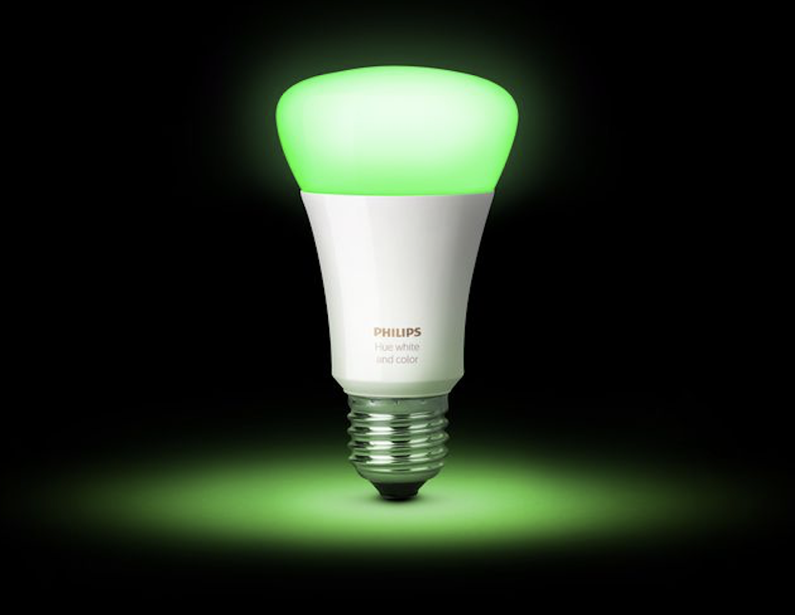
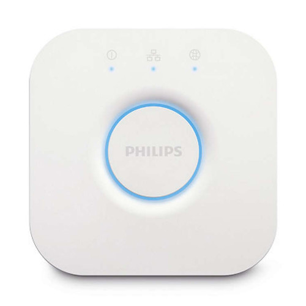

## Lights Challenge

Welcome to the last class! As you know we have spent the semester learning to
program in Python by using it to process data. This data processing has involved
both reading and writing information using data and control structures which
allow us to interact with data representations like text, CSV and JSON. We've
often used these programs to generate new insights about data and how it was
collected (e.g. the UMD TerpFootprints data).



The objective of this last exercise is to get a feel for how data processing can
(and always does) change things in the world. In this case we'll just be
changing a small thing (the color of some light bulbs) in the hopes that it
gives you the sense of how computation isn't an immaterial, abstract phenomenon,
but one that has very real material effects, which can often have social and
political consequences.

Using our knowledge of basic data types, and writing data to the web (which we
haven't talked a whole lot about yet) we are going to change the color of two
[Phillips Hue Lights] in the room. You can talk to these lights using the
HyperText Transfer Protocol (HTTP) which is the protocol that makes the World
Wide Web possible. Each of three lights in the room is listening on a local
Wi-Fi network.

### The Challenge

The goal of this exercise is to see if you can change the color of one of the
Phillips Hue lights that are in the room. We will split the class in half, where
one half of the class will try to change the color of Light 1, and the other
half will do the same for Light 2. We will also divide each side into Red, Green
and Blue, so that we know when a group was successful.

Here are some preliminary things you will need to do to get started...

### 1. Install Requests

[requests] is a Python module that makes it easy to send HTTP requests. Once you
install it you'll be able to import it into your program just like we installed
and imported pandas. Open a terminal window and type the command appropriate for
your operating system:

**OS X:**

        pip3 install requests

**Windows:**

        py -m pip install requests

### 2. Requests Documentation

You will be using requests to send HTTP requests to the lights. So open up the
[Requests Quickstart] in a browser tab for you to look at while you are doing
your work:

        https://2.python-requests.org/en/master/user/quickstart/

### 3. The Network


You need to talk to the Phillips Hue Lights using your computer's network connection.
However the UMD Wi-Fi network is fairly tightly controlled, so it's not easy to
quickly put the Phillips Hue lights on the UMD network by simply plugging them in. To get around this I've used a [tp-link] portable travel router to create a local wi-fi
network that you can join. 

**Network:** TP-Link_1B36  
**Password:** 76281273

### 4. Light State



There are two Phillips Hue lights in the room that you can talk to using the Hue
Lights API. The API is a little web server running on this device known as the
bridge:

    http://192.168.0.100/api/{key}/

So for example you can see the state of all the lights by visiting this URL in
your browser:

    http://192.168.0.100/api/ht4E04Dq3umptpRXiHqZLFzEBiJcJhypKWBxWT81/lights

You can see the state of one of the lights by adding the *light number* (1 or 2)
to the URL, for example:

    http://192.168.0.100/api/ht4E04Dq3umptpRXiHqZLFzEBiJcJhypKWBxWT81/lights/1
    http://192.168.0.100/api/ht4E04Dq3umptpRXiHqZLFzEBiJcJhypKWBxWT81/lights/2

### 5. Light Color

You can change the state of one of the lights by sending an HTTP PUT request
containing some JSON data to an API URL like:

    http://192.168.0.100/api/ht4E04Dq3umptpRXiHqZLFzEBiJcJhypKWBxWT81/lights/1/state
    http://192.168.0.100/api/ht4E04Dq3umptpRXiHqZLFzEBiJcJhypKWBxWT81/lights/2/state

The requests module has a *put()* method that lets you send data to a URL. You
can use *put* method's *json* parameter to pass in the Python data to send as
JSON.

The lights use a particular type of code (a list of floats) for color. You can
update a light's color by sending a PUT request containing JSON data for a
dictionary that contains a key "xy" that points to a list of float values.

For example sending a PUT request to the state URL containing this JSON payload
will turn that light Red:

    {"xy": [.6, .3]}

Here are the values for Red, Green and Blue for your team to use:

```python
red = [.6, .3]
green = [.4, .5]
blue = [.17, .04]
```

### 6. Color Challenge

If you were able to turn your light a particular color try to come up with other
colors by putting different "xy" values by identifying colors by their [x, y]
coordinates in the Red Triangle (Gamut B) below:

  

### 7. Timed Changes

Try to change the light different colors (perhaps random ones) in a loop. But be
sure to use a sleep command to wait between requests so you don't overwhelm the
light.  For example this command will cause your program to sleeps 5 seconds:

```python
import time

time.sleep(5)
```

### 8. Brightness

See if you can change the brightness of the lights using the "bri" key and an
integer key that has a value from 0 to 255.

### 9. On/Off

See if you can use the "on" key with a boolean value to turn off and on the
light.

[Phillips Hue Lights]: https://www2.meethue.com/en-us/bulbs
[requests]: https://2.python-requests.org/en/master/
[Requests Quickstart]: https://2.python-requests.org/en/master/user/quickstart/
[tp-link]: https://www.tp-link.com/us/home-networking/wifi-router/tl-wr902ac/

